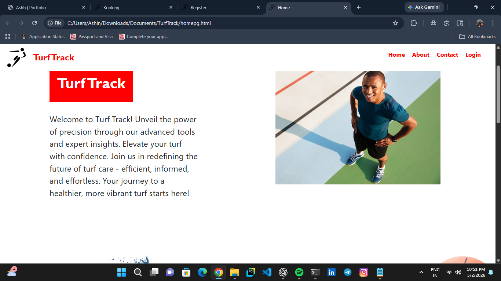
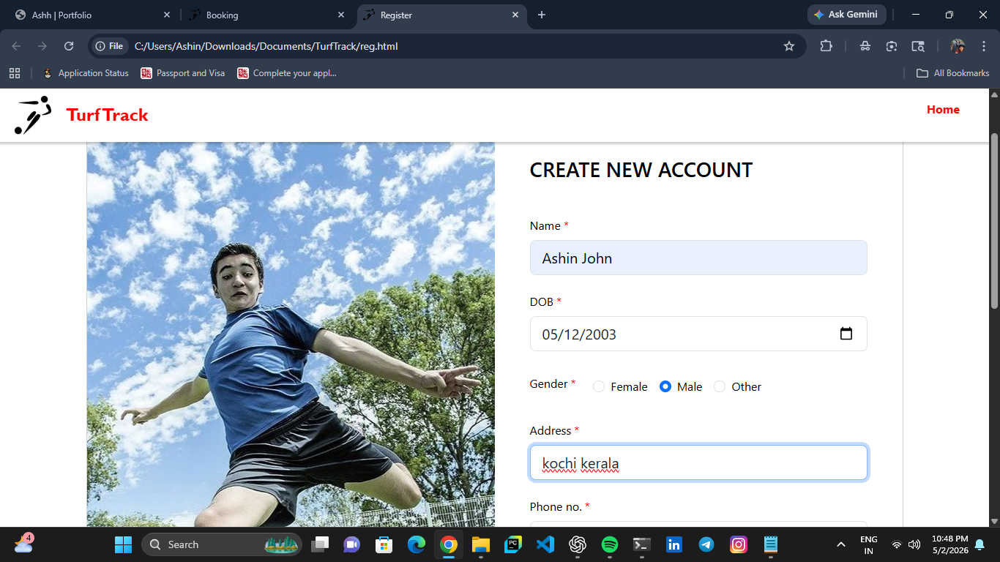
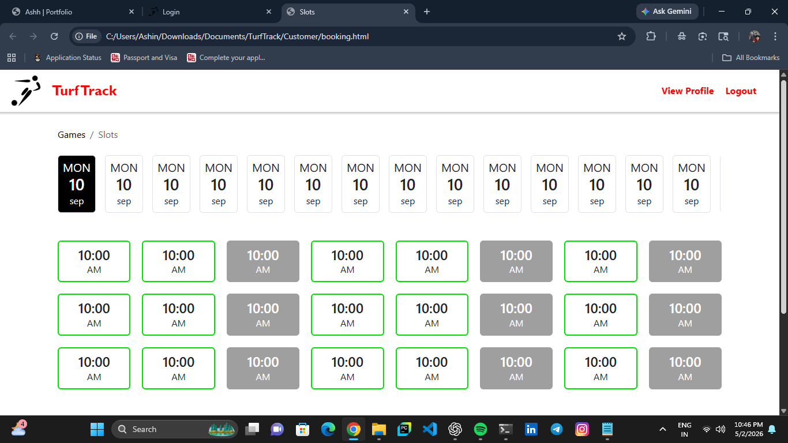
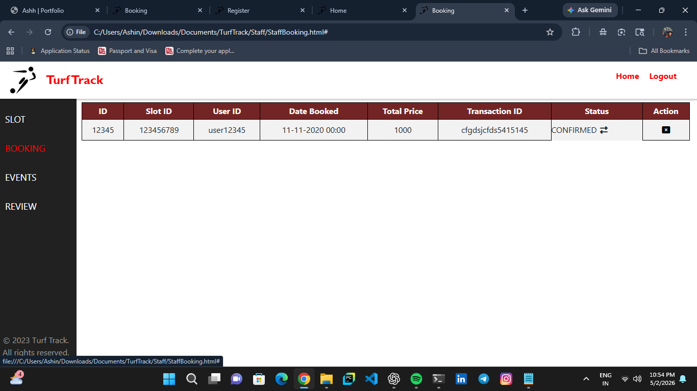

# TurfTrack - Turf Management System ⚽

## 📌 Description
TurfTrack is a web-based application designed to manage turf bookings, events, and game scheduling. It provides separate interfaces for customers, staff, and administrators.

## 🚀 Features
- User registration and login
- Turf slot booking system
- Admin dashboard to manage:
  - Bookings
  - Events
  - Games
  - Staff
- Staff interface for handling operations
- Responsive UI for users

## 🛠 Tech Stack
- Frontend: HTML, CSS, JavaScript
- Backend: PHP
- Database: MySQL

## 🧩 Modules
- Customer Panel
- Admin Panel
- Staff Panel

## 📸 Screenshots

### Home Page

### Registration Page

### Slot Booking

### Staff Panel

## ⚙️ How to Run
1. Install XAMPP / WAMP
2. Place the project folder inside `htdocs`
3. Start Apache and MySQL
4. Open browser and go to:
   http://localhost/turf-management-system

## 👨‍💻 Author
Ashh